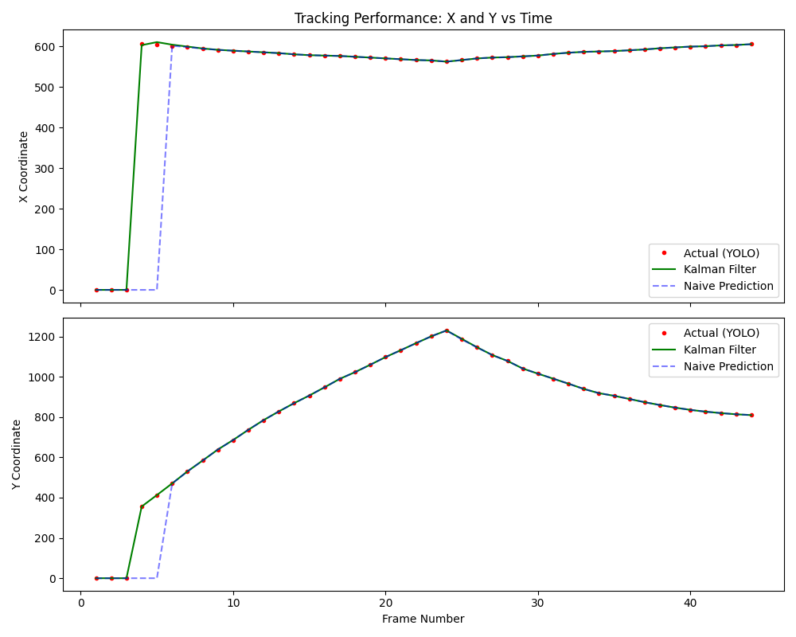

# Cricket Ball Tracking & Trajectory Prediction with YOLO11

A computer vision system designed to detect, track, and predict the trajectory of a cricket ball in real-time. This project utilizes the YOLO11 architecture for object detection and BoT-SORT for persistent multi-object tracking, with custom physics-based trajectory forecasting.

This project aims to create a pipeline that assists automatic umpiring in local Cricket. 
So far, the research has explored the open-source projects, and we aim to build something using the current state-of-the-art. 

## 🚀 Features

- Custom YOLO11 Model: Fine-tuned to detect small, high-speed cricket balls that standard COCO models often miss.
- Persistent Tracking: Uses BoT-SORT to maintain ball ID even during brief occlusions or high-velocity motion.
- Parabolic Trajectory Prediction: Uses polynomial regression to forecast the ball's path, accounting for gravity.
- Bounce Detection: Logic to identify sudden changes in vertical velocity to flag ball bounces.
- Visual Analytics: Real-time overlays for "comet-tail" history, future path prediction, and angle calculation.

## 🛠️ Requirements

- Python 3.9+
- Ultralytics YOLO11
- OpenCV (cv2)
- NumPy

```bash
pip install ultralytics opencv-python numpy
```
## 📝 Script Logic Overview

1. Velocity & Angle Calculation The script calculates the slope (\(m\)) of the ball's movement between frames. It uses a custom angle_between_lines function to determine the flight angle. If the angle exceeds 45 degrees, a "ball bounced" event is triggered in the console.
2. Future Position Prediction The system maintains a FixedSizeQueue of the last 10 centroids. It calculates the instantaneous velocity (\(x_{diff},y_{diff}\)) and projects the ball's position 5 frames into the future using:

```python
future_x = current_x + x_diff * frame_step
future_y = current_y + y_diff * frame_step
```
This logic is carried over from the repo: (https://github.com/kushagra3204/Cricket-Ball-Trajectory-Prediction). 

3. Visualization

- Blue Line: Historical path (last 10 frames).
- Green Line: Predicted future path.
- White dots: Kalman predictions
- Red Circles: Current and predicted centroids.
- Red Bounding Box: YOLO11 detection area.

## Ongoing work...
Here are some of the problems, and future work shall investigate them.
1. In gully cricket, the ball often travels at high speed (~70-100 kmph), which causes motion blur. Also the small size of the ball makes it difficult to detect the ball at a far distance.
2. When the ball is near the bounce, the current model loses tracking. This can cause problems for detecting an LBW. Future work.
3. [x] Added Kalman filter. It smooths the velocity when it get stable. This is better than the naive tracking. However KF doesnot detect a bounce. which cause the filter to lag/deviate from real ball right after the bounce

   
   
   Hence to correct this, a bounce detection is added with the logic as below:
   ```python
   p_pprev = centroid_list[-3]  # Point 1
   p_prev = centroid_list[-2]  # Point 2 (Vertex)
   p_curr = centroid_list[-1]  # Point 3

   angle = calculate_interior_angle(p_pprev, p_prev, p_curr)

   # Threshold for a bounce: if the angle is sharper than 135 degrees
   # (Adjust this based on how fast/bouncy your ball is)
   if angle < 135:
       print(f"--- BOUNCE DETECTED (Angle: {angle:.2f}) ---")
       # 1. Calculate the actual measured velocity (difference)
       meas_vx = centroid_list[-1][0] - centroid_list[-2][0]
       meas_vy = centroid_list[-1][1] - centroid_list[-2][1]
       # 2. Inject this directly into the Kalman Filter's POST-correction state
       # In OpenCV, statePost[2] is vx and statePost[3] is vy for a 4-state model
       kf.statePost[2] = meas_vx
       kf.statePost[3] = meas_vy
       # 3. (Optional) Force the position to match the measurement exactly for that frame
       kf.statePost[0] = centroid_x
       kf.statePost[1] = centroid_y
   ```
   
   When the ball bounce is detected, the KF is simply using the measured position to track.

   

   
5. Check the videos in the videos folder to see the performance so far.


